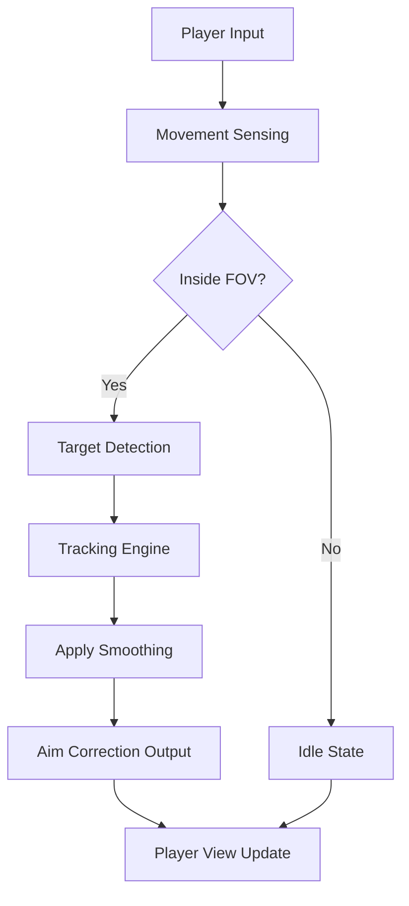

# ARC Raiders Aim Assist 

Some battles rely on brute force, but ARC Raiders rewards finesse.
This aim assist tool refines your movements, curving your reticle toward threats with a gentle pull or decisive snap depending on how you configure it.

Whether you prefer a whisper-soft correction or a bold, competitive lock, the system is sculpted to respond to your rhythm.

---

## 🎯 Features

### Adaptive Tracking Engine

Your crosshair glides with intention, responding to targets with sensitivity tuned by you.

* Customizable smoothing
* Target weight prioritization
* Motion prediction sampling
* Distance-aware adjustment curves

### FOV-Based Engagement

Define the space in which the assist awakens.

* Inner FOV zones for precision
* Outer rings for soft detection
* Per-weapon FOV variation
* Toggle for controller or mouse mode

### Dynamic Target Switching

Like a dancer shifting partners mid-step:

* Snap-on thresholds
* Visibility checks (line-of-sight aware)
* Threat-level scoring
* Optional cooldown to avoid chaotic switching

### Stability Layer

Keeps the system gentle, honest, and light:

* CPU-friendly update cycles
* Low-latency interpolation
* Micro-jitter dampening
* Anti-overcorrection logic

---

## 🪟 Compatibility

| Component        | Supported | Notes                             |
| ---------------- | --------- | --------------------------------- |
| Windows 10/11    | ✔️        | Runs best on 21H2+                |
| ARC Raiders (PC) | ✔️        | Both Steam & Epic                 |
| Keyboard + Mouse | ✔️        | Full curve tuning                 |
| Gamepad Support  | ✔️        | Optional assist boost             |
| High FPS Systems | ✔️        | Assistance adapts to frame pacing |

[!IMPORTANT]
All visual and assist effects are user-adjustable, offering accessibility-friendly presets for comfort.

---

## ⚡ Setup Guide

1. **Download and extract** the tool into any writable folder.
2. **Start the Loader** (Run as Administrator recommended).
3. Choose your preferred aim profile:

   * *Soft Assist*
   * *Competitive Curve*
   * *High-Tension Lock*
4. Launch ARC Raiders.
5. Open the overlay with:

   ```
   CTRL + ALT + L
   ```
6. Fine-tune parameters using sliders or manual input fields.

### Example Config (JSON)

```json
{
  "smoothing": 6.5,
  "aim_strength": 0.42,
  "fov_inner": 18,
  "fov_outer": 42,
  "visibility_check": true,
  "switch_speed": 0.28
}
```

### Controller Curve Sample

```json
{
  "deadzone": 0.12,
  "curve": "expo_soft",
  "max_assist": 0.65
}
```

---

## 📊 Mermaid Diagram — Targeting Flow



---

## 🔧 Sample Profiles

### Whisper Precision (Natural Feel)

```
strength = 0.28
smooth = 9.0
inner_fov = 15
outer_fov = 32
```

### Reactive Combat (Midline Assist)

```
strength = 0.55
smooth = 5.0
inner_fov = 20
outer_fov = 40
switch = dynamic
```

### High-Tension Lock (Aggressive)

```
strength = 0.82
smooth = 2.5
inner_fov = 28
outer_fov = 55
cooldown = 0.05
```

---

## ❓ FAQ

### **Does this replace player skill?**

No—it's a stabilizer, not a substitute. It complements your ability rather than overrides it.

### **Is it performance-heavy?**

Not at all. The algorithm is optimized to maintain high framerates even on mid-range systems.

### **Can I build multiple profiles?**

Yes—any number of profiles can be saved and switched mid-match.

### **Does it work with scoped weapons?**

Yes, with separate scope sensitivity and assist scaling.

### **How fast do updates release?**

Usually within 24–48 hours of ARC Raiders patches.

---

## 🌙 Final Thoughts

There’s a rhythm to firefights—
a pulse between decision and precision.
This ARC Raiders Aim Assist simply tunes that rhythm,
letting your reticle follow intention rather than hesitation.

It turns chaos into choreography,
giving your shots a little poetry of their own.

---
